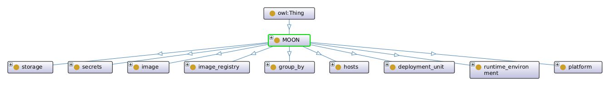
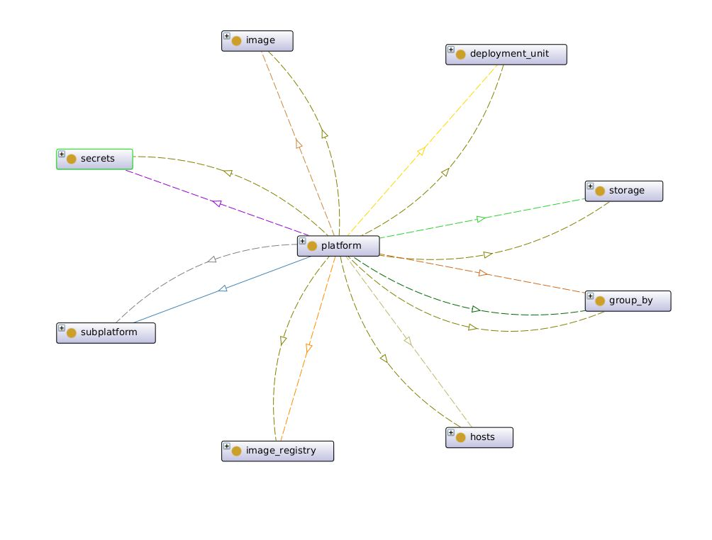
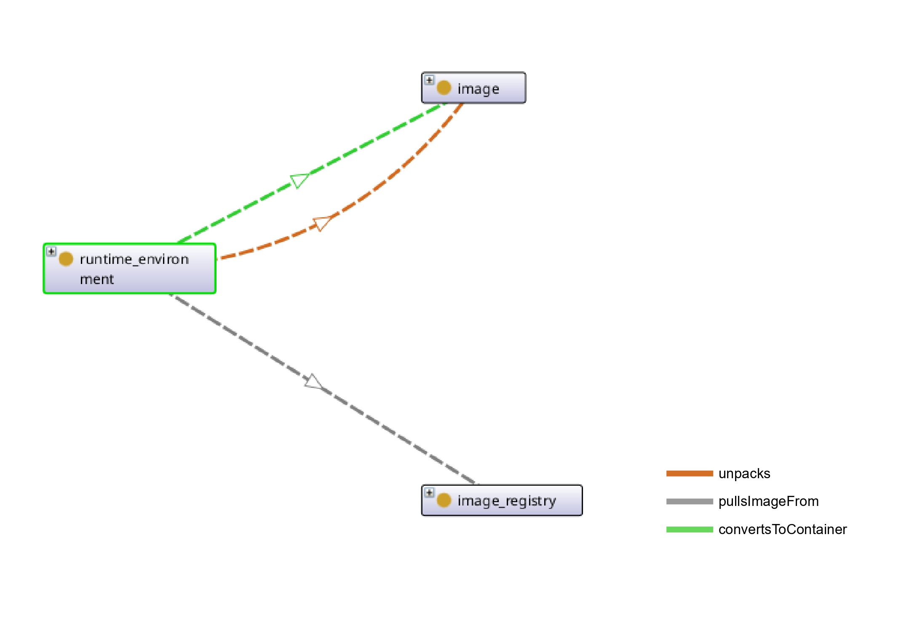
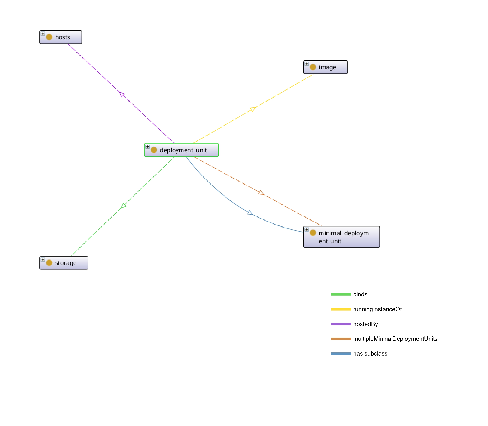
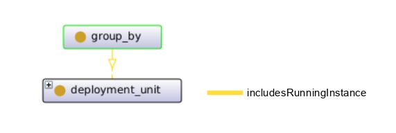
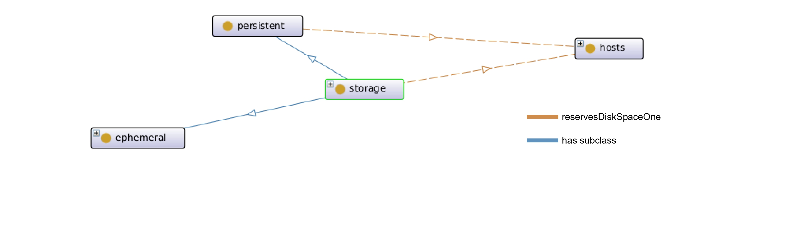
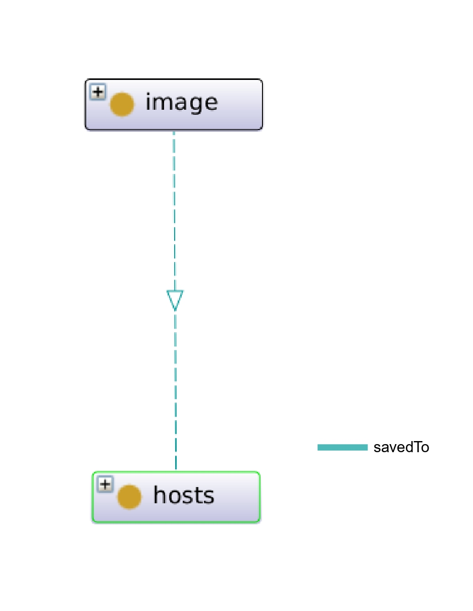
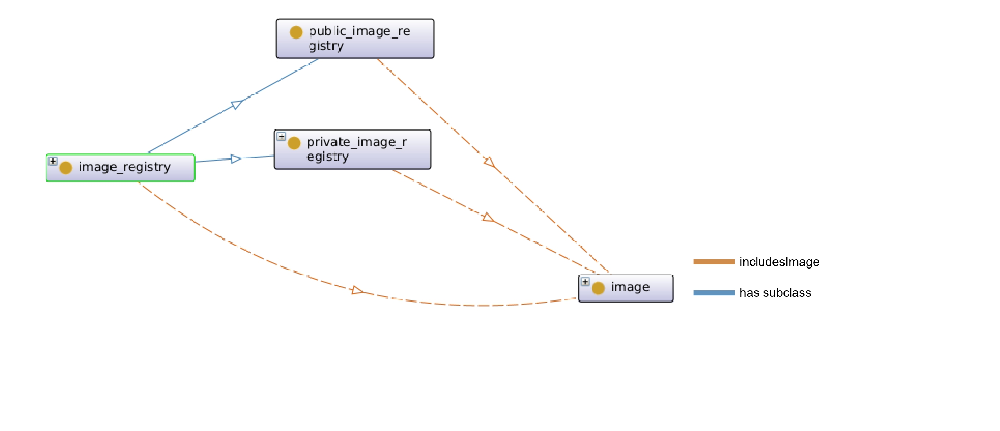
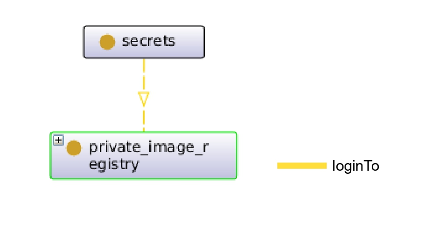

# MOON: A Comprehensive Microservice Orchestration Ontology For Container Platforms

This repository contains an OWL entity that describes the semantics of technologies capable of deploying applications via container orchestration.

The main purpose of this OWL entity is to describe the semantics of these technologies in a top-down manner. In this way, the reader will first learn the essential semantics of container orchestration and then become familiar with entities such as Docker and Kubernetes.

## Main Entities
MOON defines nine key classes related to container platforms. The platform class represents the chosen container platform, while runtime_environment describes the tools used during runtime. The deployment_unit class specifies the format for deploying application components. The group_by class represents the relationship between multiple containers within the same application. The host class describes the machines hosting deployed components, and storage details the required data storage. The image class represents Docker images, while image_registry describes registries where images are stored. Lastly, the secrets class defines credentials needed to access restricted image registries.

1. [Platform Class](#platform-class)
2. [Runtime Environment Class](#runtime-environment-class)
3. [Deployment Unit Class](#deployment-unit-class)
4. [Group By Class](#group-by-class)
5. [Host Class](#host-class)
6. [Storage Class](#storage-class)
7. [Image Class](#image-class)
8. [Image Registry Class](#image-registry-class)
9. [Secrets Class](#secrets-class)

## Platform Class
The **platform** class is designed to describe container platforms such as Docker or Kubernetes. A state-of-the-art container platform is composed of several key concepts that are required to orchestrate application components. These concepts are, in fact, sibling classes of the platform class. In the MOON ontology, the composedOf object property represents a high-level relationship that links the platform class with its sibling classes. Semantically, this means that the platform class is formed by the combination of its sibling classes.

MOON models key processes in container platforms using object properties. When a deployment request is made, the platform first checks for the image locally; if unavailable, it pulls the image from a registry (**pullsImageFrom**). Private registries require credentials, generating secrets (**generatesSecrets**). Storage and container groupings are also created using **generatesStorage** and **generatesGroupBy**. The deploys property represents the deployment of components using supported formats. Platforms manage multiple applications by organizing components in isolated environments (**multipleGroupBy**).

Runtime environments handle image pulling, unpacking, and container operations (**utilize**). Platforms cluster multiple hosts for container orchestration, represented by the **includesHost** property.

## Runtime Environment Class
MOON models the **runtime environment** as a crucial component of container orchestration using the **runtime_environment** class. This environment handles tasks such as pulling images from registries (**pullingImageFrom**), unpacking them (**unpacks**), and converting them into running containers (**convertsToContainer**). An image is a lightweight, standalone package containing all dependencies, while a container is its active instance running in isolation. These relationships are visually represented in the MOON ontology.

## Deployment Unit Class
The **deployment_unit** class in MOON defines the deployment units supported by platforms, with containers being the most common. Containers are isolated environments based on Docker images to facilitate application components. This class can represent both containers and application components. However, Kubernetes uses **pods** as its deployment unit, which can host multiple containers. To account for this, MOON introduces the **minimal_deployment_unit** class as a subclass of **deployment_unit**. The relationship between these classes is captured through the **hasSubclass** object property.

Container orchestration aims to find a capable host for the application component within a container. MOON uses the **hostedBy** object property to link the **deployment_unit** class with the **host** class, representing where the container is hosted. The **deployment_unit** class also uses the **runningInstanceOf** property to indicate that a container is a running instance of a Docker image. If the container generates output data that requires storage, MOON connects the **deployment_unit** to **storage** through the **bind** object property. Additionally, MOON supports an object property to link **deployment_unit** with **minimal_deployment_unit** for use in certain deployment scenarios.

## Group By Class
MOON includes the **group_by** class to represent Docker networks, Docker services, Kubernetes services, and Kubernetes namespaces. It uses the **includesRunningInstance** object property to link the **group_by** class with the **deployment_unit** class, illustrating the relationship between these entities and containers or pods.

## Host Class
The **host** class in MOON is unique in that it has no outgoing object properties. This is because hosts do not trigger orchestration actions themselves in Docker or Kubernetes; instead, runtime environments are responsible for pulling and storing Docker images. Therefore, the **host** class is considered a passive entity, with only incoming object properties.

## Storage Class
The **storage** class in MOON represents the overall storage capabilities of container platforms and is closely linked to the **host** class, which allocates disk space for deployed containers. Storage is categorized into two types: **ephemeral** and **persistent**, represented by corresponding subclasses.  

- **Ephemeral storage** exists only for the duration of a container or pod, used for temporary files or scratch data. In Docker, the writable layer of a container is ephemeral, while in Kubernetes, ephemeral storage includes local empty directories and container layers.  
- **Persistent storage** allows data to survive beyond container lifecycles, managed through volumes in Docker and Kubernetes. These volumes can use cloud storage, network file systems, or local disks.  

MOON models this relationship using the **hasSubclass** property, linking **storage** to its **ephemeral** and **persistent** subclasses. The **reservesDiskSpaceOn** property represents disk allocation on a host for **storage** and **persistent** classes but does not apply to **ephemeral** storage, as it is temporary.

## Image Class
The **image** class in MOON represents Docker images, which are self-contained, executable packages with all necessary code, libraries, and dependencies. Developers can use pre-existing images or create custom ones, often built from public or private registries. These images are stored in registries and retrieved by platforms like Docker or Kubernetes for deployment. To model this process, the **image** class includes the **savedTo** object property, indicating that images are stored on local hosts before being used to create containers.

## Image Registry Class
The **image_registry** class in MOON represents repositories that store and manage Docker images, either publicly or privately. Popular registries include **Docker Hub**, which provides public and private repositories with features like versioning and automated builds, and **Quay**, which offers enhanced security and enterprise-level management. Additionally, the **Docker Registry** image allows users to create private or public repositories for image distribution.  

MOON distinguishes between **public_image_registry** and **private_image_registry** subclasses to indicate access restrictions. The **includesImage** object property links registries to stored images. However, MOON does not yet have a specific class for describing repositories within a registry.

## Secrets Class

The **secrets** class in MOON represents authentication credentials used by container platforms to access private image registries. It includes the **loginTo** object property, which models the authentication process.

In **Docker**, authentication is handled via the `docker login` command before orchestration begins, while **Kubernetes** uses declarative secrets that can be dynamically created and managed during orchestration. Both platforms store credentials in Base64-encoded format to enable secure **push** and **pull** operations from private registries.