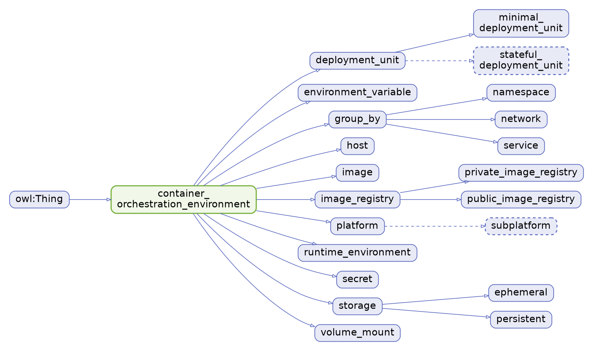
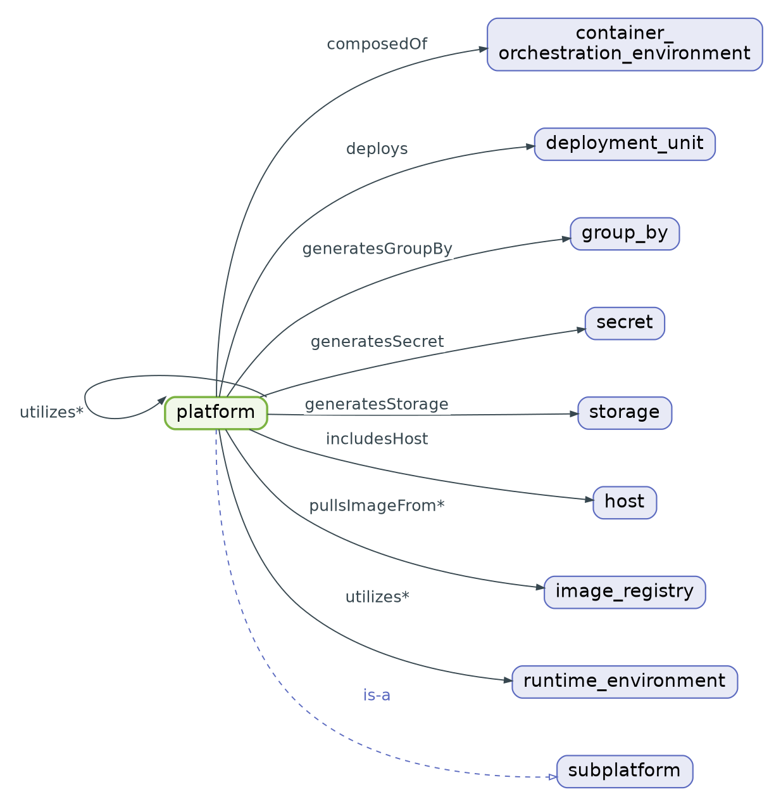
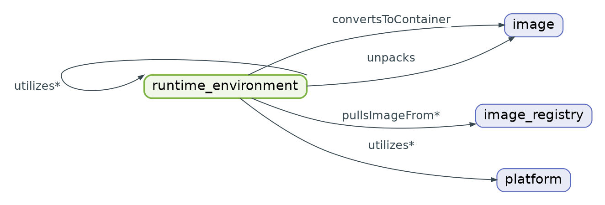
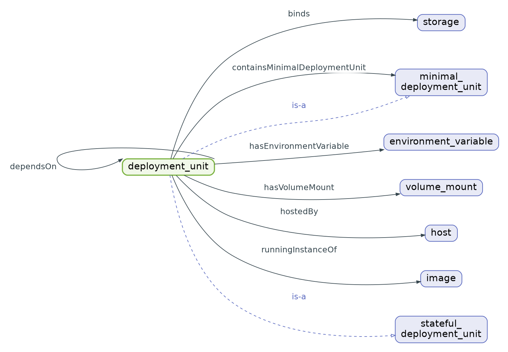
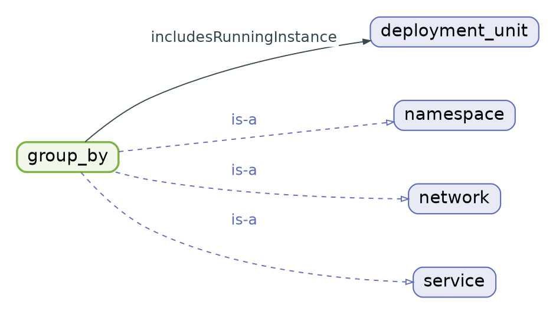
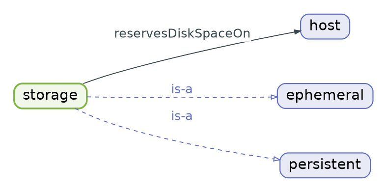
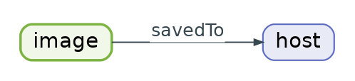
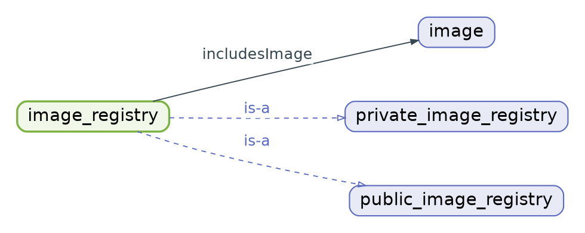
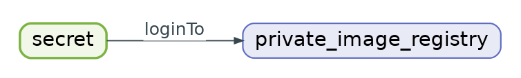
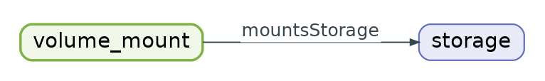

# CADO: Semantic Representation of Container Deployment Workflows

CADO (Containerized Application Deployment Ontology) is an OWL ontology that
describes containerized application deployment in a platform-agnostic way, and
a set of tools that turn a CADO description into the deployment artifacts of
Docker and of Kubernetes.

One description, written once, yields both a Docker Compose file and a set of
Kubernetes manifests. The vocabulary carries no term specific to either
platform: the notational differences between them live in the converter, not in
the ontology.

Two worked examples are included, both described with the same, unchanged
T-Box: a WordPress + MySQL application, and a three-tier microservice (nginx
edge, API served from a private registry, Redis cache). See
[Example deployments](#example-deployments).

**At a glance:** 22 classes, 27 object properties, 21 data properties. Every
term carries a label and a definition. Two classes are defined by equivalence
and their members are computed by the reasoner rather than asserted.

## Contents

1. [Main entities](#main-entities)
2. [Platform Class](#platform-class)
3. [Runtime Environment Class](#runtime-environment-class)
4. [Deployment Unit Class](#deployment-unit-class)
5. [Group By Class](#group-by-class)
6. [Host Class](#host-class)
7. [Storage Class](#storage-class)
8. [Image Class](#image-class)
9. [Image Registry Class](#image-registry-class)
10. [Secret Class](#secret-class)
11. [Environment Variable and Volume Mount](#environment-variable-and-volume-mount)
12. [Inferred classes](#inferred-classes)
13. [Python tools](#python-tools)
14. [Example deployments](#example-deployments)
15. [Figures](#figures)
16. [Repository layout](#repository-layout)

## Main Entities

Nine classes carry the core vocabulary. `platform` represents the chosen
container platform and `runtime_environment` the engines it uses at run time.
`deployment_unit` is the unit a platform schedules, `group_by` the construct
that scopes a set of such units, and `host` the machine one runs on. `storage`
describes the data a unit keeps, `image` the packaged application, and
`image_registry` where images are held. `secret` carries the credentials needed
to reach a restricted registry.

Two further classes, `environment_variable` and `volume_mount`, reify concepts
that cannot be attached to a single individual without ambiguity, and two more,
`subplatform` and `stateful_deployment_unit`, are not asserted at all but
inferred. Both groups are described below.



Every figure in this README is generated from `entity.owx`, so a diagram cannot
contradict the axioms it illustrates.

### Platform Class

The **platform** class describes container platforms such as Docker or
Kubernetes. `composedOf` is the high-level relationship linking a platform to
the concepts it orchestrates.



When a deployment is requested the platform pulls any image it does not hold
locally (**pullsImageFrom**). A private registry requires credentials, modelled
with **generatesSecret**. Storage and grouping constructs are created through
**generatesStorage** and **generatesGroupBy**, and **deploys** relates a
platform to the units it schedules. **includesHost** relates it to the machines
it can schedule onto, and **utilizes** to the runtime environments, or to
another platform, that it builds on.

`composedOf` and `utilizes` are **asymmetric** and **irreflexive**: a platform
cannot be composed of itself, and two platforms cannot use each other. Both
axioms are universal rather than existential, so a platform is constrained in
what it may be composed of without being required to be composed of anything.

### Runtime Environment Class

The **runtime_environment** class models the engines a platform relies on. A
runtime environment pulls images from registries (**pullsImageFrom**), unpacks
them (**unpacks**) and converts them into running containers
(**convertsToContainer**).



### Deployment Unit Class

The **deployment_unit** class covers what a platform schedules. A Docker
container and a Kubernetes pod are both deployment units. Because a pod may hold
several containers, CADO adds **minimal_deployment_unit** as a subclass, defined
as the running instance of exactly one image; **containsMinimalDeploymentUnit**
relates a composite unit to the minimal units inside it.



**hostedBy** places a unit on a host, **runningInstanceOf** relates it to the
image it runs, and **binds** to the storage it uses. **dependsOn** orders one
unit against another and is asymmetric and irreflexive, so a unit cannot depend
on itself.

### Group By Class

CADO includes the **group_by** class to represent the grouping constructs of
container platforms. It is defined as *a named grouping construct that scopes a
set of deployment units and governs how they are addressed by one another* — the
property Docker networks, Docker Swarm and Kubernetes services, and Kubernetes
namespaces all share, and the reason a single abstraction is justified.

Because those constructs differ in *how* they scope, `group_by` has three
disjoint subclasses rather than covering them in one flat class:

| Subclass | Scopes deployment units by | Platform construct | Naming property |
|---|---|---|---|
| `network` | link-layer reachability | Docker network | `network_name` |
| `service` | a single stable endpoint | Docker Swarm service, Kubernetes service | `service_name` |
| `namespace` | name isolation | Kubernetes namespace | `namespace_name` |

The subclass an individual belongs to is what determines which construct the
converter renders it as, so recording only the parent class would leave that
choice undetermined.

**includesRunningInstance** links a grouping construct to the units it scopes.



### Host Class

The **host** class is passive: it triggers no orchestration action of its own,
since it is the runtime environments that pull and store images. It carries a
single outgoing property, **hosts**, which exists only as the inverse of
**hostedBy** so that the units placed on a host can be retrieved directly. Every
other relation involving a host is incoming.

### Storage Class

The **storage** class represents the storage a deployment uses, and is linked to
`host`, which supplies the disk space. It has two disjoint subclasses:

- **Ephemeral storage** lasts only as long as the unit using it. It becomes a
  `tmpfs` mount under Compose and an `emptyDir` under Kubernetes, with no claim.
- **Persistent storage** outlives the unit. It becomes a named volume under
  Compose, and a PersistentVolume with a PersistentVolumeClaim under Kubernetes.



**reservesDiskSpaceOn** relates storage to the host backing it. Persistent
storage is required to have at least one such host, which is what distinguishes
it from ephemeral storage; this is one of only two existential axioms in CADO.

### Image Class

The **image** class represents container images: self-contained packages
carrying the code, libraries and dependencies an application needs. The
**savedTo** object property records the host an image is stored on before it is
used to create a container.



### Image Registry Class

The **image_registry** class represents repositories that store and manage
images, publicly or privately. CADO distinguishes **public_image_registry** and
**private_image_registry** as disjoint subclasses, and **includesImage** relates
a registry to the images it holds.



`includesImage` has a single domain, `image_registry`. Declaring it on the
superclass and both subclasses at once would require a registry to be public and
private simultaneously, which is unsatisfiable once the two are disjoint. CADO
therefore gives every property exactly one domain axiom and one range axiom,
writing a genuine disjunction as an explicit union — as `pullsImageFrom` does
over `platform` and `runtime_environment`.

### Secret Class

The **secret** class represents the credentials a platform uses to reach a
private registry, with **loginTo** modelling the authentication target.



Docker authenticates with `docker login` before a plan is applied, while
Kubernetes injects a Secret manifest referenced by `imagePullSecrets` during
deployment. The converter handles both from the same description.

### Environment Variable and Volume Mount

Two classes exist because the concepts they carry cannot be attached to a single
individual without ambiguity.

- **environment_variable** is a name/value pair supplied to a deployment unit,
  reached through `hasEnvironmentVariable` and carrying `variable_name` and
  `variable_value`. Modelling variables as data properties named after
  particular variables, as `env_mysql_database` and the like, would tie the
  schema to one application.
- **volume_mount** is the attachment of one storage resource to one deployment
  unit at one path, reached through `hasVolumeMount` and carrying `mount_path`
  and `mountsStorage`. This lets a unit mount several volumes at distinct paths.



The convenient direct relation between a unit and its storage is then derived
rather than asserted, through the property chain
`hasVolumeMount ∘ mountsStorage ⊑ binds`.

### Inferred classes

Every class but two is primitive: an individual belongs to it because a modeller
says so. The remaining two are defined by an equivalence axiom, so their members
are computed by the reasoner and are never asserted in an A-Box.

| Class | Equivalent to | Reads as |
|---|---|---|
| `subplatform` | `platform and utilizedBy some platform` | a platform that another platform builds on |
| `stateful_deployment_unit` | `deployment_unit and hasVolumeMount some (mountsStorage some persistent)` | a unit that mounts persistent storage |

Nothing states that Docker is a subplatform. A modeller states that Docker is a
platform and that Docker Swarm uses it, and the reasoner concludes the rest.

## Python Tools

| Tool | Purpose |
|---|---|
| `validator.py` | HermiT consistency and satisfiability, plus closed-world constraint checking |
| `converter.py` | Generates Docker Compose and Kubernetes artifacts from an ontology description |
| `cado_graph.py` | Ontology access layer: every lookup is a traversal of CADO, never a name match |
| `docker_functions.py` | Compose rendering backend |
| `kubernetes_functions.py` | Kubernetes manifest rendering backend |
| `artifact_check.py` | Offline structural validation of the generated artifacts |
| `competency_questions.py` | Answers the 13 competency questions, including four defect checks |
| `regression_tests.py` | The claims made about CADO, in executable form |
| `ontology_summary.py` | Emits the class/property/restriction tables in Markdown or LaTeX |
| `generate_figures.py` | Regenerates every figure from the ontology, as PDF, PNG and editable draw.io |
| `figure_palette.py` | Shared relationship palette, with a CIE Lab separation check |
| `dot_to_drawio.py`, `colour_edges.py` | draw.io export, and palette application to existing diagrams |

The converter never inspects the name of an individual. It selects its output
syntax from the `artifact_format` data property asserted on the platform, and
reaches everything else by traversing object properties, so renaming every
individual in a model leaves the generated artifacts byte-identical.

### Setup

```bash
conda create -n owl_env python=3.10
conda activate owl_env
pip install owlready2 pyyaml
```

A Java runtime is required, since Owlready2 invokes HermiT. `docker`, `kubectl`
and `kind` are optional and used only for the live deployment.

### Validating and generating

`reproduce.sh` runs the sequence end to end: it validates both models with
HermiT (the WordPress + MySQL application and the three-tier microservice),
generates the artifacts for both, and checks the generated artifacts
structurally.

```bash
./reproduce.sh          # validation, generation, offline structural check
./reproduce.sh --live   # also deploys to Docker and to a kind cluster, then tears both down
```

Expected output: every step reports `OK`, 15 artifact files are written under
`generated_files/`, and the script exits zero. It exits non-zero if any step
fails. The `--live` path removes the Compose project and the kind cluster on
every exit path, including interruption, so a failed run leaves nothing behind.

### Individual tools

```bash
cd ontology_python_tools

# Validate (exits non-zero on any violation or undocumented term)
python validator.py --classes ../ontology_files/entity.owx \
                    --instances ../ontology_files/instances.owl

# Generate deployment artifacts
python converter.py --classes ../ontology_files/entity.owx \
                    --instances ../ontology_files/instances.owl \
                    --out ../generated_files

# ...or for the three-tier microservice
python converter.py --classes ../ontology_files/entity.owx \
                    --instances ../ontology_files/instances_microservice.owl \
                    --out ../generated_files/microservice

# Check the generated artifacts without a cluster
python artifact_check.py ../generated_files ../generated_files/microservice

# Answer the competency questions
python competency_questions.py --classes ../ontology_files/entity.owx \
                               --instances ../ontology_files/instances.owl

# Regenerate the summary tables (Markdown or LaTeX)
python ontology_summary.py --classes ../ontology_files/entity.owx \
                           --format latex
```

## Example deployments

| A-Box | Describes | Exercises |
|---|---|---|
| `ontology_files/instances.owl` | WordPress + MySQL on Docker and Kubernetes | The running example of the paper |
| `ontology_files/instances_microservice.owl` | Three-tier microservice (nginx edge → API from a private registry → Redis cache) on Docker and Kubernetes | Scaling, resource limits, published ports, multiple networks per unit, a service grouping, a private registry with credentials, ephemeral and persistent storage, a dependency chain |

Load one A-Box at a time; they describe the same platform individuals.

Neither required any change to the T-Box, which is the point: `entity.owx`
carries no term specific to any one deployment.

## Figures

All figures are generated from the ontology, so a diagram cannot contradict the
axioms it illustrates:

```bash
cd ontology_python_tools
python3 generate_figures.py --out ../figures
```

Each figure is written as a vector `.pdf` for the paper, a `.png` preview, and an
editable `.drawio`. Editing a `.drawio` by hand adopts that figure: the generator
notices and will not overwrite it on the next run. Every run also checks that no
two relationship colours appearing in the same diagram are closer than 25 units
in CIE Lab. See `figures/README.md`.

## Repository layout

```
ontology_files/
    entity.owx                      T-Box (schema)
    instances.owl                   A-Box: WordPress + MySQL
    instances_microservice.owl      A-Box: three-tier microservice
    v1_archive/                     the previous version, for diffing
ontology_python_tools/              validator, converter and evaluation tools
figures/                            figures generated from the ontology (pdf, png, drawio)
generated_files/                    artifacts generated from instances.owl (WordPress + MySQL)
generated_files/microservice/       artifacts generated from instances_microservice.owl (three-tier microservice)
ONTOLOGY_SUMMARY.md                 generated class and property reference
CHANGES.md                          what changed since v1 and why
reproduce.sh                        validation, artifact generation and structural check
run_evaluation.sh                   the above, plus every other reported result
```
