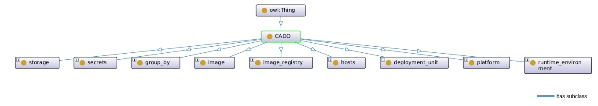
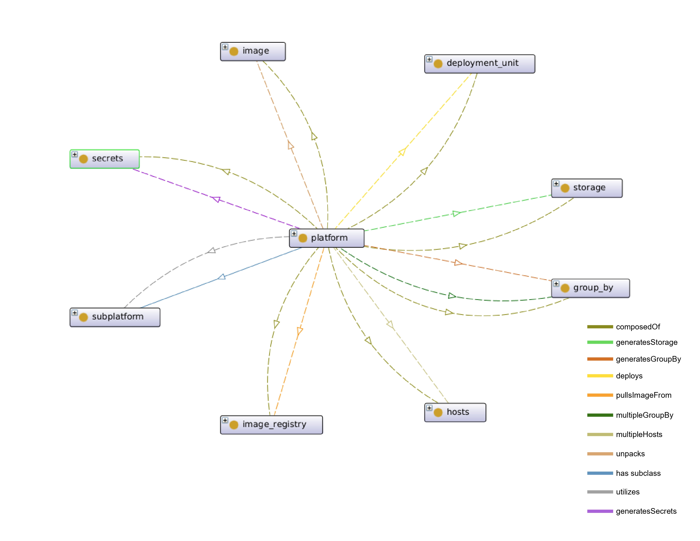

# MOON: A Comprehensive Microservice Orchestration Ontology For Container Platforms

This repository contains an OWL entity that describes the semantics of technologies capable of deploying applications via container orchestration.

The main purpose of this OWL entity is to describe the semantics of these technologies in a top-down manner. In this way, the reader will first learn the essential semantics of container orchestration and then become familiar with entities such as Docker and Kubernetes.

## Main Entities
MOON defines nine key classes related to container platforms. The platform class represents the chosen container platform, while runtime_environment describes the tools used during runtime. The deployment_unit class specifies the format for deploying application components. The group_by class represents the relationship between multiple containers within the same application. The host class describes the machines hosting deployed components, and storage details the required data storage. The image class represents Docker images, while image_registry describes registries where images are stored. Lastly, the secrets class defines credentials needed to access restricted image registries.

1. [Platform Class](#platform-class)
2. [Runtime Environment Class](#runtime-environment-class)
3. [Deployment Unit Class](#deployment-unit-class)
4. [Group By Class](#group-by-class)
5. [Host Class](#host-class)
6. [Storage Class](#storage-class)
7. [Image Class](#image-class)
8. [Image Registry Class](#image-registry-class)
9. [Secrets Class](#secrets-class)

## Platform Class
The platform class is designed to describe container platforms such as Docker or Kubernetes. A state-of-the-art container platform is composed of several key concepts that are required to orchestrate application components. These concepts are, in fact, sibling classes of the platform class. In the MOON ontology, the composedOf object property represents a high-level relationship that links the platform class with its sibling classes. Semantically, this means that the platform class is formed by the combination of its sibling classes.

MOON models key processes in container platforms using object properties. When a deployment request is made, the platform first checks for the image locally; if unavailable, it pulls the image from a registry (pullsImageFrom). Private registries require credentials, generating secrets (generatesSecrets). Storage and container groupings are also created using generatesStorage and generatesGroupBy. The deploys property represents the deployment of components using supported formats. Platforms manage multiple applications by organizing components in isolated environments (multipleGroupBy).

Runtime environments handle image pulling, unpacking, and container operations (utilize). Platforms cluster multiple hosts for container orchestration, represented by the includesHost property.

## Runtime Environment Class
## Deployment Unit Class
## Group By Class
## Host Class
## Storage Class
## Image Class
## Image Registry Class
## Secrets Class